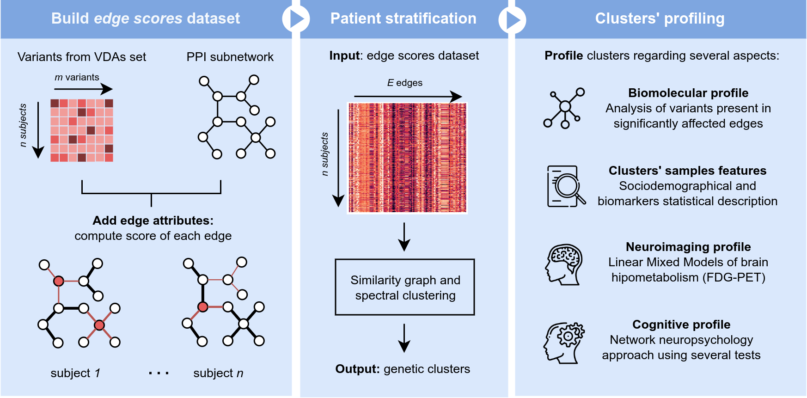

# AD_genetics_stratification

## Description
Code repository for the paper entitled ["Genetic-based patient stratification in Alzheimer’s disease"](https://www.nature.com/articles/s41598-024-60707-1). The repository follows the methodology and results presented in the mentioned work.

## Organization
The results obtained are organized in the following notebooks:

The results obtained for the manuscript are organized in the following notebooks:

* [00_make_datasets](00_make_datasets.ipynb) - generate edge scores datasets that will be used as input for clustering.
* [01_clustering](01_clustering.ipynb) - perform clustering with edge scores data (Similarity Network Fusion + spectral clustering)
* [02_bio_analysis](02_bio_analysis.ipynb)  - describe clusters regarding significant differences, important genetic variants, etc.
* [03_clusters_description](03_clusters_description.ipynb)  - describe clusters regarding sociodemographic, clinical, and biomarkers data.
* [04_neurocognitive_analysis](04_neurocognitive_analysis.ipynb)  - obtain neurocognitive networks for each cluster.

These notebooks call several scripts or take as input their results. The mentioned scripts are:

* [extract_variants.sh](extract_variants.sh) - bash script for extracting genetic variants from the original VCF files.
* [bio_networks.py](bio_networks.py) - scripts for obtaining the biological network employed.
* [obtain_edges_scores.py](obtain_edges_scores.py) - script for obtaining the individual edge scores.
* [utils_description.py](utils_description.py) - script containing several functions for data and statistical analyses.
* [neurocognitive_analysis_utils.py](neurocognitive_analysis_utils.py) - script containing several functions for obtaining neurocognitive networks and performing statistical analyses. This work is based on the original work done by Ana Solbas at [asolbas/AD-CogNet](https://github.com/asolbas/AD-CogNet).

Other directories in this repository:

* [data](data) contains several data files used in this work.
* [figures](figures) figures obtained for this work and present in the paper.

Please note that several files, such as raw genetic data, datasets built from it, and other data files for clusters' descriptions (sociodemographics, clinical, neuroimaging, biomarkers, neurocognitive) are unavailable in this repository for privacy reasons. ADNI data can be accessed under formal request at [adni.loni.usc.edu/data-samples/access-data](https://adni.loni.usc.edu/data-samples/access-data/).

